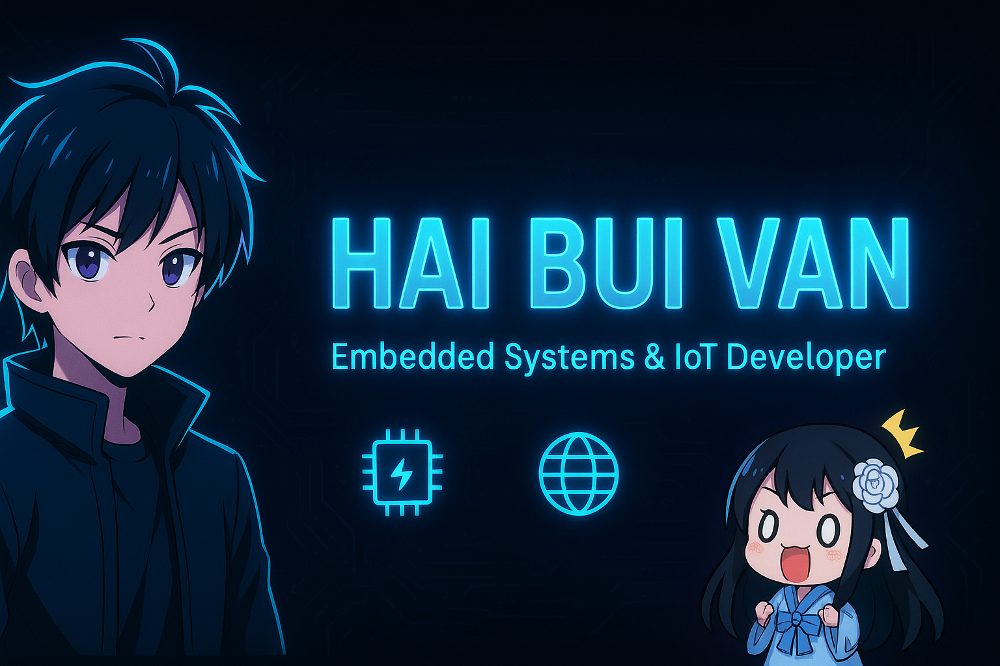

<!-- Banner -->

# 👋 Hi, I'm Hai Bui Van

💡 I'm passionate about **Embedded Systems Development** and love working with low-level programming, microcontrollers, and IoT applications.  

---

## 📊 GitHub Stats

---

## 💻 Most Used Languages

---

## ⚡ Embedded Skills
- C / C++ for Microcontrollers  
- ARM Cortex-M, STM32, AVR  
- RTOS (FreeRTOS)  
- Communication Protocols: USART, I2C, SPI, USB  
- Hardware Debugging & Firmware Development  

---

## 🔧 Tools & Technologies

---

## 🌐 Connect with me

---
